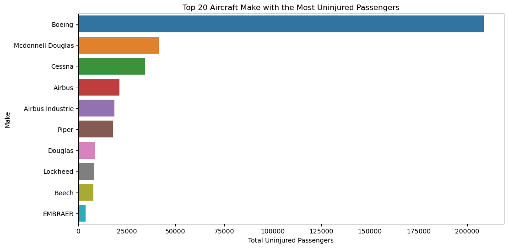
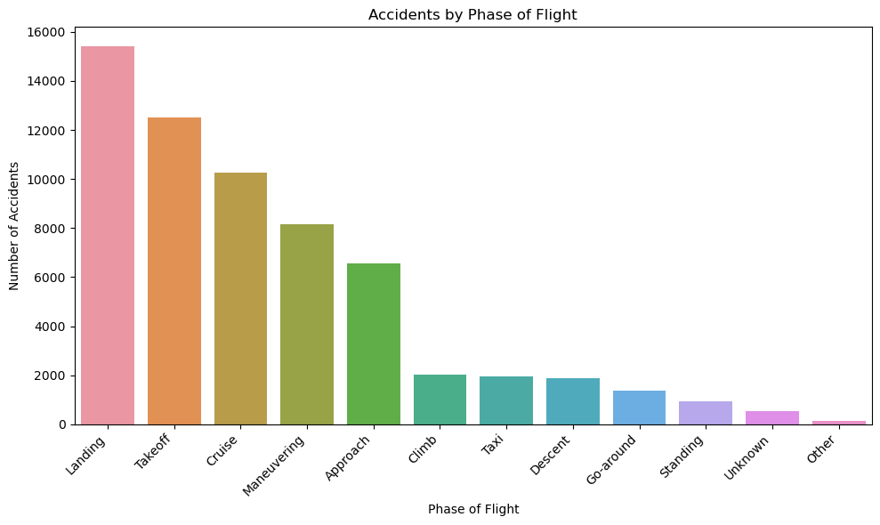
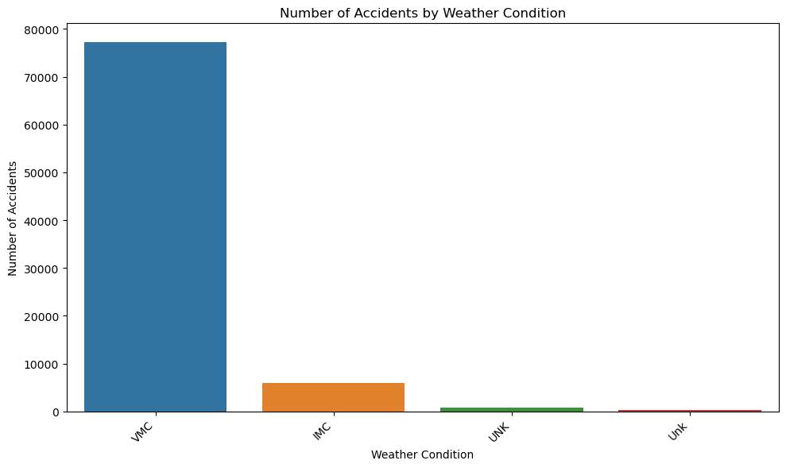

# Aviation Accident Risk Assessment for Business Expansion

## Overview

This project analyzes aviation accident data from the National Transportation Safety Board (NTSB) to assess the risk associated with different aircraft. The analysis aims to provide data-driven recommendations for a company looking to expand into the aviation sector, specifically in purchasing and operating commercial and private airplanes. The goal is to identify the safest aircraft options and operational strategies to minimize risk.

## Business Understanding

### Stakeholder

Head of the new aviation division.

### Key Business Questions

* Which aircraft makes and models present the lowest risk for investment?
* What are the primary factors contributing to aviation accidents (e.g., weather, phase of flight)?
* How can the company mitigate risks associated with aircraft operation?
* What operational procedures or training programs can enhance safety?

## Data Understanding and Analysis

### Source of Data

The data is sourced from the National Transportation Safety Board (NTSB) aviation accident dataset, covering civil aviation accidents and incidents in the United States and international waters from 1962 to 2023.

### Description of Data

The dataset contains information on various aspects of aviation accidents, including:

* Accident details (date, location, type)
* Aircraft information (make, model, category)
* Injury severity (fatal, serious, minor, uninjured)
* Weather conditions
* Phase of flight
* Other relevant factors

### Data Analysis Summary

The analysis involved:

* Cleaning and preprocessing the data (handling missing values, data type conversions).
* Calculating accident rates and injury rates.
* Analyzing accident trends by year, aircraft make, phase of flight, and weather conditions.# Aviation Accident Risk Assessment for Business Expansion

## Overview

This project analyzes aviation accident data from the National Transportation Safety Board (NTSB) to assess the risk associated with different aircraft. The analysis aims to provide data-driven recommendations for a company looking to expand into the aviation sector, specifically in purchasing and operating commercial and private airplanes. The goal is to identify the safest aircraft options and operational strategies to minimize risk.

## Business Understanding

### Stakeholder

Head of the new aviation division.

### Key Business Questions

* Which aircraft makes and models present the lowest risk for investment?
* What are the primary factors contributing to aviation accidents (e.g., weather, phase of flight)?
* How can the company mitigate risks associated with aircraft operation?
* What operational procedures or training programs can enhance safety?

## Data Understanding and Analysis

### Source of Data

The data is sourced from the National Transportation Safety Board (NTSB) aviation accident dataset, covering civil aviation accidents and incidents in the United States and international waters from 1962 to 2023.

### Description of Data

The dataset contains information on various aspects of aviation accidents, including:

* Accident details (date, location, type)
* Aircraft information (make, model, category)
* Injury severity (fatal, serious, minor, uninjured)
* Weather conditions
* Phase of flight
* Other relevant factors

### Data Analysis Summary

The analysis involved:

* Cleaning and preprocessing the data (handling missing values, data type conversions).
* Calculating accident rates and injury rates.
* Analyzing accident trends by year, aircraft make, phase of flight, and weather conditions.

### Three Visualizations

*(You should include the actual visualizations here. If you can't directly embed them, provide links to where they can be viewed, e.g., in the notebook or dashboard)*

1.  **Uninjured by Aircraft Make (Top 20):** *()*
2.  **Accidents by Phase of Flight:** *()*
3.  **Accidents by Weather Condition:** *()*

## Conclusion

The analysis of the NTSB aviation accident data led to the following key findings:

1.  *(State finding 1,  Certain aircraft manufacturers have a statistically lower accident rate.)*
2.  *(State finding 2,  A significant proportion of accidents occur during the landing phase.)*
3.  *(State finding 3, Adverse weather conditions significantly increase the risk of accidents.)*

These findings suggest that the company should prioritize aircraft from safer manufacturers, implement enhanced landing training, and develop strict weather-related operational guidelines.

## Recommendations

Based on the analysis, the following recommendations are made:

1.  *( Recommendation 1,  Prioritize aircraft from manufacturers with lower accident rates such as Boeing, Piepr amd Cessna)*
2.  *(Recommendation 2,  Implement enhanced training for high-risk phases of flight (e.g., landing, approach).)*
3.  *(Recommendation 3,  Develop and enforce strict operational guidelines for varying weather conditions, involve stricter go/no go criteria and improved weather forcasting and communication.)*

## Interactive Dashboard

The interactive dashboard for exploring the data can be found at:  *(https://public.tableau.com/app/profile/tinah.ngei/viz/Phase1ProjectInteractiveDashBoard/Phase1ProjectInteractiveDashboard?publish=yes)*

### Three Visualizations

1.  **Accidents by Aircraft Make (Top 10):** *()*
2.  **Accidents by Phase of Flight:** *()*
3.  **Accidents by Weather Condition:** *()*

## Conclusion

The analysis of the NTSB aviation accident data led to the following key findings:

1.  *(State finding 1, Certain aircraft manufacturers have a statistically lower accident rate.)*
2.  *(State finding 2, A significant proportion of accidents occur during the landing phase.)*
3.  *(State finding 3, Adverse weather conditions significantly increase the risk of accidents.)*

These findings suggest that the company should prioritize aircraft from safer manufacturers, implement enhanced landing training, and develop strict weather-related operational guidelines.

## Recommendations

Based on the analysis, the following recommendations are made:

1.  *(State Recommendation 1, Prioritize aircraft from manufacturers with lower accident rates such as Cessna, Piper and Boeing)*
2.  *(State Recommendation 2, Implement enhanced training for high-risk phases of flight (e.g., landing, approach).)*
3.  *(State Recommendation 3, Develop and enforce strict operational guidelines for varying weather conditions.)*

## Notebook(s)

* `notebooks/aviation_accident_analysis.ipynb`: This is the main notebook containing the data analysis. It is designed to run without errors.
